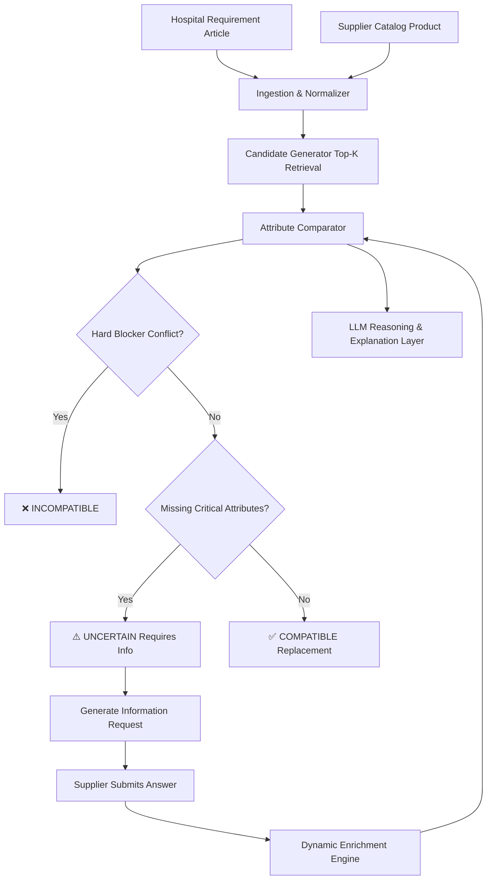

# SANOVIO Product Match

> 🏥 **SANOVIO Product Match** is an intelligent medical consumable matching and product replacement decision platform for hospitals and medical supply distributors. The system combines a **deterministic clinical & physical attribute rule engine** with **LLM-assisted semantic reasoning** to analyze specification differences, enforce safety-critical constraints, generate targeted supplier inquiries for missing data, and provide explainable compatibility decisions with confidence scoring.

---

## 📑 Table of Contents

- [Key Features](#-key-features)
- [System Architecture & Workflow](#-system-architecture--workflow)
- [Technology Stack](#-technology-stack)
- [Project Structure](#-project-structure)
- [Quick Start](#-quick-start)
  - [1. Environment Configuration](#1-environment-configuration)
  - [2. Start Backend API](#2-start-backend-api)
  - [3. Start Frontend UI](#3-start-frontend-ui)
- [API Reference](#-api-reference)
- [Decision Engine & Matching Principles](#-decision-engine--matching-principles)
- [Supplier Q&A & Dynamic Enrichment Loop](#-supplier-qa--dynamic-enrichment-loop)
- [LLM Provider Configuration](#-llm-provider-configuration)
- [License](#-license)

---

## 🌟 Key Features

1. **Deterministic Clinical Safety Hard Blockers**:
   - Clinical incompatibilities (e.g., sterile vs. non-sterile, incompatible connector types like Luer-Lock vs. NRFit, gauge/dimension mismatches) immediately yield an `incompatible` decision. Safety rules cannot be bypassed by fuzzy matching or embeddings.
2. **Multi-Tier Candidate Generation**:
   - Category pre-filtering, token/keyword matching, and dimensional tolerance checks rapidly retrieve the top-$K$ candidate replacements from thousands of supplier SKUs.
3. **Granular Attribute Compatibility Matrix**:
   - Compares every specification dimension side-by-side with clear status indicators (`match`, `conflict`, `missing`) and criticality tiers (`hard_blocker`, `critical`, `important`, `informational`).
4. **Automated Information Requests & Dynamic Enrichment**:
   - When a supplier product lacks critical decision attributes, the system marks the comparison as `uncertain` and formulates targeted questions.
   - When answers are submitted, the system enriches the catalog entry and **automatically re-runs the comparison**, upgrading confidence and decisions in real time.
5. **Interactive Single-Page Web Application**:
   - Clean healthcare-grade UI featuring a dashboard with key metrics, hospital demand catalog, side-by-side comparison modal with diff highlights, and a supplier Q&A workbench.

---

## 🏗️ System Architecture & Workflow



---

## 💻 Technology Stack

- **Backend**:
  - **Python 3.10+** / **FastAPI**: High-performance asynchronous REST API
  - **SQLAlchemy 2.0** + **SQLite**: Database ORM and persistent storage
  - **Pydantic v2**: Type validation and schema serialization
  - **Pandas / OpenPyXL / pdfplumber**: Multi-format medical catalog ingestion
  - **Anthropic Claude SDK**: Optional advanced semantic reasoning and multilingual explanations
- **Frontend**:
  - **Vite 6** + **TypeScript**
  - **Custom Healthcare Tech Design System (CSS)**
  - Responsive layouts, modals, diff highlighting, and toast alerts

---

## 📂 Project Structure

```text
sanovio-product-match/
├── backend/
│   ├── app/
│   │   ├── api/             # FastAPI routes, CORS, and dependency injection
│   │   ├── comparison/      # Attribute comparator and Decision Engine
│   │   ├── db/              # Database engine, base model, and session helpers
│   │   ├── enrichment/      # Supplier Q&A processing and product enrichment
│   │   ├── ingestion/       # Hospital and supplier catalog importers & normalizers
│   │   ├── llm/             # LLM provider abstraction (Mock, Rule-Based, Anthropic)
│   │   ├── matching/        # Candidate generation and ranking logic
│   │   ├── models/          # SQLAlchemy ORM database models
│   │   └── schemas/         # Pydantic v2 request/response models
│   └── requirements.txt     # Python dependencies
├── data/
│   └── sample/              # Sample hospital article and supplier data
├── frontend/
│   ├── src/
│   │   ├── api.ts           # Typed frontend API client
│   │   ├── main.ts          # Application logic, tabs, modals, and event handlers
│   │   ├── style.css        # Modern CSS theme and UI design system
│   │   └── types.ts         # TypeScript interfaces matching backend models
│   ├── index.html           # HTML entry point
│   ├── package.json         # Node.js dependencies and build scripts
│   └── vite.config.ts       # Vite development configuration
├── .env.example             # Environment variable template
└── README.md                # Project documentation
```

---

## 🚀 Quick Start

### 1. Environment Configuration

Copy the example configuration file:
```bash
cp .env.example .env
```

Key environment variables in `.env`:
```env
LLM_PROVIDER=mock          # Options: mock (offline demo), rule_based, anthropic
ANTHROPIC_API_KEY=your_key # Required only when LLM_PROVIDER=anthropic
DATABASE_URL=sqlite:///./sanovio.db
```

### 2. Start Backend API

Install Python dependencies and run the FastAPI server:
```bash
pip install -r backend/requirements.txt
uvicorn backend.app.api:app --reload --port 8000
```
> 💡 **Note**: On startup, the application automatically initializes the SQLite database (`sanovio.db`) and seeds sample hospital articles (syringes, infusion lines, dressings) and supplier catalogs.

Interactive Swagger API documentation is available at:
👉 **http://127.0.0.1:8000/docs**

### 3. Start Frontend UI

In a separate terminal, start the Vite development server:
```bash
cd frontend
npm install
npm run dev
```

Open your browser at:
👉 **http://localhost:5173**

---

## 📡 API Reference

| Method | Path | Description |
| :--- | :--- | :--- |
| `GET` | `/api/dashboard` | Returns overall system statistics (counts of articles, comparisons, decisions, questions). |
| `GET` | `/api/articles` | Lists all hospital articles with aggregated match status. |
| `GET` | `/api/articles/{id}` | Returns a single hospital article's details. |
| `GET` | `/api/articles/{id}/comparisons` | Lists ranked supplier candidate replacements for a specific hospital article. |
| `GET` | `/api/supplier-products` | Lists all supplier catalog products with detailed specifications. |
| `POST` | `/api/comparisons/run` | Triggers batch candidate generation and decision comparison for all items. |
| `GET` | `/api/comparisons/{id}` | Retrieves full evidence breakdown, side-by-side attributes, and open questions for a comparison. |
| `GET` | `/api/questions` | Lists all information requests (filterable by `status=open` or `status=answered`). |
| `POST` | `/api/questions/{id}/answer` | Submits an answer to a question, enriches supplier attributes, and re-evaluates the match. |
| `POST` | `/api/reset` | Resets and re-seeds the database to the initial demo state. |

---

## ⚖️ Decision Engine & Matching Principles

The decision engine evaluates attributes across four criticality levels:

1. **Hard Blocker**:
   - Critical clinical safety constraints (e.g., `sterility`, incompatible `connector_type` such as Luer-Lock vs. NRFit).
   - Any conflict immediately results in `incompatible` with zero chance of override.
2. **Critical**:
   - Primary physical dimensions (volume, outer diameter, needle length, material compatibility).
   - If missing from supplier data, the decision defaults to `uncertain` and generates an `InformationRequest`.
3. **Important**:
   - Graduation markings, packaging unit specifications, DIN/ISO compliance norms.
4. **Informational**:
   - Target price benchmarks, brand preferences, MDR regulatory classification.

---

## 💬 Supplier Q&A & Dynamic Enrichment Loop

```text
[Missing Spec Detected] ➔ [InformationRequest Created] ➔ [Supplier Submits Answer]
                                                                    │
[Match Re-evaluated: COMPATIBLE] 🠔 [Catalog Enriched with Provenance] 🠔─┘
```

1. **Identification**: Missing critical specs (e.g., sterilization method or DIN ISO norms) generate structured question items.
2. **Submission**: Suppliers provide clarification via the UI or API (e.g., `"EO-sterilisiert"`, `"DIN EN ISO 7886-1"`).
3. **Enrichment & Audit Trail**: The engine extracts the normalized attribute value, updates the product record, and tags the provenance source as `supplier_response`.
4. **Real-Time Re-evaluation**: The comparison automatically runs again, upgrading `uncertain` to `compatible` and updating confidence scores.

---

## 🤖 LLM Provider Configuration

Set `LLM_PROVIDER` in `.env` to choose the reasoning provider:

- **`mock` (Default)**: Uses pre-configured realistic clinical responses and explanations. Works 100% offline without API keys.
- **`rule_based`**: Pure deterministic rule engine with zero external dependencies and maximum execution speed.
- **`anthropic`**: Connects to Claude 3 / 3.5 for natural language explanations, multi-lingual normalization, and dynamic question synthesis.

---

## 📄 License

This project is licensed under the [MIT License](LICENSE).
